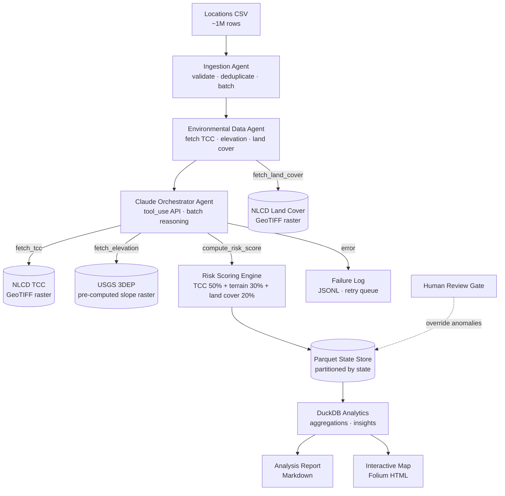

# LEO Satellite Coverage Risk Analysis

An agent-driven data pipeline that scores ~1 million GPS coordinates for LEO satellite (Starlink) signal-obstruction risk using national tree canopy, terrain, and land cover datasets. Built for the [Ready Builders Challenge #50](https://github.com/ready/builders-challenge/issues/50) — the output supports state broadband officers in understanding where committed LEO coverage may be degraded by environmental conditions.

## Quick Start

Clone to running in 5 commands:

```bash
git clone <repo-url>
cd leo-satellite-coverage-risk
pip install -r requirements.txt
cp .env.example .env   # then add your ANTHROPIC_API_KEY
python pipeline.py --csv data/locations.csv
```

## Architecture

The pipeline is a chain of typed agents: ingestion → environmental enrichment → Claude tool-use orchestration → deterministic risk scoring → Parquet state store → analytics + reporting.



Full diagrams (including the per-batch tool-use sequence) live in [`docs/architecture.md`](docs/architecture.md).

## Decision Log

| Decision | Alternatives considered | Reasoning | What I'd revisit |
|---|---|---|---|
| NLCD Land Cover over OSM buildings | OSM building footprints | OSM completeness is lowest in rural areas — exactly where underserved communities are. NLCD is the same dataset family as TCC: same CRS, same resolution, zero extra infrastructure. | Building height data if it becomes nationally available |
| rasterio + GeoPandas over PostGIS | PostGIS + Docker | Point-in-raster operations are natively a raster problem. PostGIS adds a database server with no analytical benefit for this use case. | PostGIS for polygon spatial joins at 100x scale |
| Native Anthropic SDK over LangChain | LangChain, LangGraph | Fewer abstractions = clearer tool call tracing. Every step of the agent loop is visible and debuggable. Critical for a live review. | LangGraph for complex multi-agent graphs |
| DuckDB over PostgreSQL | PostgreSQL, in-memory pandas | Embeddable, no server, SQL on Parquet files, handles 1M+ rows analytically without loading into memory. | Cloud data warehouse (BigQuery/Redshift) at 100x scale |
| Pre-computed slope raster over per-point windowed reads | Per-point Horn's method | Computing slope from a 3x3 window per location at 1M locations = 1M rasterio reads. Pre-computing once = 1 GDAL operation + 1M lookups. ~100x faster. | — |
| Sonnet for orchestration, Opus for planning | Opus throughout | Sonnet is sufficient for structured tool dispatch. At 20k Claude calls (1M / 50 batch), cost management is a real constraint. Opus reserved for ambiguous reasoning. | — |

See [`docs/decision_log.md`](docs/decision_log.md) for the full set with v1.0 → v2.0 change notes.

## Key Findings

_[To be filled after pipeline run.]_

- % of locations at HIGH obstruction risk: `TBD`
- % of locations at MODERATE risk: `TBD`
- % of locations at LOW risk: `TBD`
- Top 5 at-risk states: `TBD`
- Top 10 at-risk counties: `TBD`

## Data Sources

| Dataset | Source | Obstruction factor | Why chosen |
|---|---|---|---|
| NLCD 2021 Tree Canopy Cover | USGS / MRLC | Tree canopy obstruction (primary) | Continuous 0–100% canopy density, nationally consistent at 30m resolution |
| USGS 3DEP Elevation | USGS National Map | Terrain slope + sky horizon angle | Only consistent national DEM; slope directly modulates the 25° minimum elevation requirement |
| NLCD 2021 Land Cover | USGS / MRLC | Land-use context + structural density | Same dataset family as TCC (same CRS/resolution); cross-validates canopy readings |

See [`docs/data_sourcing.md`](docs/data_sourcing.md) for source URLs, version pins, and quality notes.

## Known Limitations

- NLCD TCC is a static 2021 snapshot; deciduous canopy varies seasonally (open item OI-03 with the Ready team).
- Slope is computed at 10–30m DEM resolution; gentle gradients may be imprecise.
- Building height is not available in any national public dataset, so structural obstruction is approximated via NLCD developed-code density only.
- Trees below 30m raster resolution are not captured.
- Microsite conditions (rooftop access, mounting options, HOA restrictions) require physical assessment.

## Running the Pipeline

Batch mode (full dataset):
```bash
python pipeline.py --csv data/locations.csv
```

Subset mode (for testing):
```bash
python pipeline.py --csv data/locations.csv --states CA TX
```

Resume mode (after interruption):
```bash
python pipeline.py --csv data/locations.csv --resume
```

Interactive mode (single location):
```bash
python pipeline.py --mode interactive
```

## Production Considerations

These are not built in this implementation but are the right next steps for productionization:

- **Orchestration:** Replace the sequential pipeline runner with Apache Airflow DAGs for scheduling, retries, and monitoring.
- **Data access:** Use Cloud-Optimized GeoTIFFs (COGs) on S3 with HTTP range requests instead of full file downloads — enables serverless access and eliminates the 3–4 GB local download requirement.
- **Scale:** At 100x locations, the Claude API layer needs async dispatch with a queue. The Parquet + DuckDB layer scales without changes.
- **Drift detection:** Rerun quarterly. Compare risk score distribution (mean, P25/P75/P90) against baseline. A >5% shift in the High+Critical tier triggers a dataset version review.
- **Building height:** When national LiDAR becomes available (USGS 3DEP LiDAR program is expanding), add canopy height and building height as additional factors.

## Project Structure

```
leo-satellite-coverage-risk/
├── docs/        # Architecture, decision log, analysis rationale, data sourcing
├── src/
│   ├── agents/  # Ingestion, environmental, orchestrator, scoring, output
│   ├── tools/   # fetch_tcc, fetch_elevation, fetch_land_cover (raster lookups)
│   ├── data/    # Downloader (NLCD/3DEP) + Parquet/DuckDB store
│   ├── schemas/ # Pydantic data contracts for every pipeline stage
│   └── utils/   # Logger, metrics, geo helpers
├── tests/       # pytest unit tests per module
├── pipeline.py  # Main entrypoint (batch + interactive modes)
├── pyproject.toml
└── requirements.txt
```

## License

MIT
