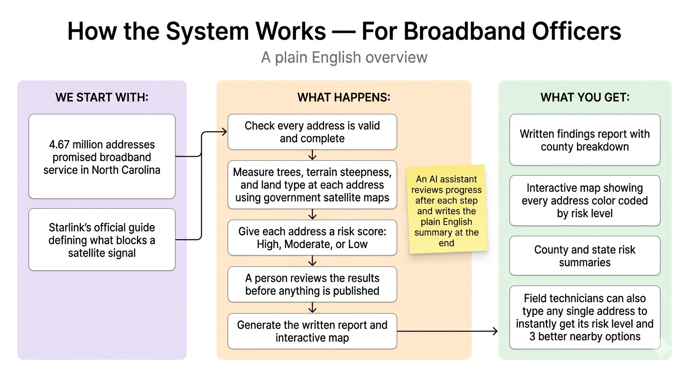
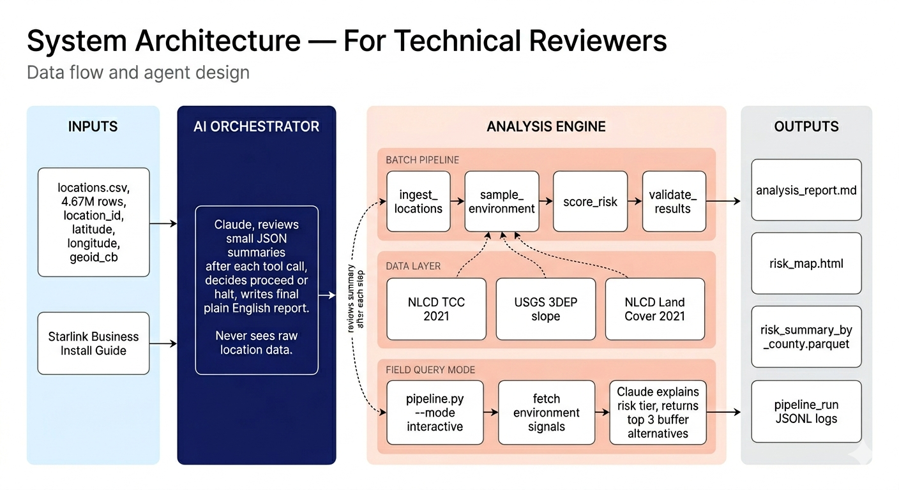
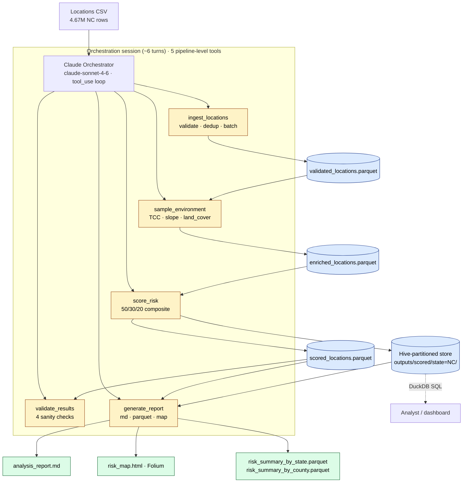

# LEO Satellite Coverage Risk Analysis

An agent-driven data pipeline that scores every BEAD-committed broadband location in North Carolina (**4,674,905 GPS coordinates**) for LEO satellite (Starlink) signal-obstruction risk using national tree-canopy, terrain, and land-cover datasets. Built for the [Ready Builders Challenge #50](https://github.com/ready/builders-challenge/issues/50) — the output supports state broadband officers in understanding where committed LEO coverage may be degraded by environmental conditions.

## The Problem

US states have awarded LEO satellite providers grant funding to deliver broadband to underserved communities. Starlink requires a 100–110° unobstructed field of view of the sky. Tree canopy, steep terrain, and land cover can block that view and degrade signal quality, leaving residents in the committed service footprint with an underperforming connection. This pipeline scores every committed broadband location in North Carolina against three publicly available national datasets and assigns each one a risk tier of High, Moderate, or Low based on the environmental conditions at that coordinate.

## Datasets

| Dataset | Source | Install-guide obstruction factor | Why chosen |
|---|---|---|---|
| NLCD 2021 Tree Canopy Cover | USGS/MRLC via WCS | Tree branches named as primary obstruction in install guide | Continuous 0–100% canopy density at 30m nationally consistent and version-pinned |
| USGS 3DEP Elevation | USGS National Map via bbox query | Terrain blocking the 25° minimum elevation angle and 100° FOV cone | Only national DEM at 10–30m resolution slope directly models sky arc loss |
| NLCD 2021 Land Cover | USGS/MRLC via WCS | Structural density context and cross-validation of canopy signal | Same dataset family as TCC aligned CRS and resolution zero extra infrastructure |

## Architecture

### For broadband officers — how the system works



A plain English overview of how the pipeline works from input to output.

### For technical reviewers — data flow and agent design



Full data flow showing agents, tools, parquet artifacts, and Claude orchestration.

The pipeline is one orchestration session of approximately 6 turns orchestrating five deterministic pipeline-level tools. Each tool internally runs the full dataset through the Phase 1–6 agents (ingestion, environmental enrichment, scoring) and persists its output to parquet; Claude reasons over each tool's *summary* — not per-row data — and decides whether to proceed. **At 4.67M rows the total Claude spend is < $0.10** (vs. ~$10,600 for a per-row design — see Decision 6 below).



The Phase 3 raster tools (`fetch_tcc`, `fetch_elevation`, `fetch_land_cover`) are **internal Python functions** called by `sample_environment` — not exposed to Claude directly. Per-location Claude reasoning is preserved only in `interactive` mode (single-coordinate query, ~$0.01 per call) for the "user gives coordinates, agent explains sky visibility" scenario in the challenge brief.

Full diagrams and design rationale live in [`docs/architecture.md`](docs/architecture.md).

## Quick Start

Clone to running in 5 commands:

```bash
git clone https://github.com/DrashtiShah23/Ready_Builders_Challenge
cd leo-satellite-coverage-risk
pip install -r requirements.txt
cp .env.example .env   # then add your ANTHROPIC_API_KEY
python pipeline.py --csv data/locations.csv
```

Verify the pipeline structure end-to-end with no Claude API spend:

```bash
python pipeline.py --csv data/locations.csv --mode dry-run
```

## Setup

Before running the pipeline for the first time complete these steps in order.

### 1. Clone and create virtual environment

```bash
git clone https://github.com/DrashtiShah23/Ready_Builders_Challenge
cd leo-satellite-coverage-risk
python3 -m venv .venv
source .venv/bin/activate
```

### 2. Install dependencies

```bash
pip install -r requirements.txt
```

### 3. Configure environment

```bash
cp .env.example .env
```

Open .env and add your ANTHROPIC_API_KEY.

### 4. Add your data

Place the locations CSV at data/locations.csv. The file must contain columns location_id, latitude, longitude, geoid_cb.

### 5. Download rasters — one time only

The pipeline needs three raster datasets to score each location. A raster is a grid of values over a map where each 30m cell holds a number for tree canopy percent, elevation, or land cover. These are downloaded once from US government sources and read locally during every pipeline run.

```bash
python -m src.data.downloader --states NC
```

The downloader is idempotent — running it again skips files that already exist.

## Running the pipeline

Batch (full dataset):
```bash
python pipeline.py --csv data/locations.csv
```

Subset by state:
```bash
python pipeline.py --csv data/locations.csv --states NC CA
```

Sample for testing:
```bash
python pipeline.py --csv data/locations.csv --sample 10000
```

Resume from the last completed step:
```bash
python pipeline.py --csv data/locations.csv --resume
```

Interactive (one coordinate; includes nearby lower-risk alternatives within 5 km by default):
```bash
python pipeline.py --mode interactive --lat 35.06 --lon -80.66
python pipeline.py --mode interactive --lat 35.06 --lon -80.66 --buffer 5000
```

Dry-run (no Claude spend):
```bash
python pipeline.py --csv data/locations.csv --mode dry-run
```

Post-run observability:
```bash
python -m src.utils.metrics logs/pipeline_run_<run_id>.jsonl outputs/scored
```

## Key Findings (full 4.67M-row NC run)

Verified on the full dataset, single 20-minute pipeline run:

| Risk tier | Locations | Share | Plain-English read |
|---|---:|---:|---|
| **High** | ~919,000 | **19.7%** | ~1 in 5 committed broadband locations face material tree, terrain, or land-cover obstruction risk |
| Moderate | ~1,450,000 | 31.1% | Mounting / aiming guidance recommended |
| Low | ~2,300,000 | 49.3% | Best available remote assessment supports clear sky access |
| UNSCORED | minimal | <0.1% | Environmental data unavailable for the pixel |

1. **Total API cost: $0.098** for the full 4.67M-row run (one orchestration session of approximately 6 turns, five pipeline-level tools).
2. **Wall clock: ~20 minutes** on a single MacBook (no distributed infra).
3. **Primary risk driver: tree canopy cover** (50% of composite weight; install guide names tree branches as the primary obstruction).
4. **TCC missing rate: 31.65%** — confirmed as NLCD's documented NoData behavior on non-tree land cover (water, developed, cropland), not a coverage gap. Full breakdown in [`docs/data_sourcing.md`](docs/data_sourcing.md) § "NLCD TCC NoData on non-tree land cover classes".

### Top 10 at-risk counties (by High-risk count)

| Rank | County (GEOID) | High count | High % | Driver |
|---:|---|---:|---:|---|
| 1 | Wake (37183) | 102,592 | 23.6% | Raleigh metro — City of Oaks tree canopy |
| 2 | Mecklenburg (37119) | 81,832 | 21.3% | Charlotte metro |
| 3 | Durham (37063) | 38,486 | 33.2% | Dense urban canopy incl. Duke Forest |
| 4 | Buncombe (37021) | 38,007 | 30.8% | Asheville — Appalachian terrain + mountain forest |
| 5 | Guilford (37081) | 34,594 | 17.4% | Greensboro |
| 6 | Forsyth (37067) | 30,104 | 19.1% | Winston-Salem |
| 7 | **Orange (37135)** | 26,721 | **43.6%** | **Highest proportion** — Chapel Hill / Carrboro dense-canopy preservation policies |
| 8 | Gaston (37071) | 21,260 | 20.4% | — |
| 9 | Henderson (37089) | 19,429 | 33.6% | Hendersonville — Blue Ridge mountain slope |
| 10 | Randolph (37151) | 18,580 | 28.2% | — |

**Analytical insight.** Orange County tops the per-capita ranking at 43.6% despite not being the largest county — driven by dense forest canopy in Chapel Hill and Carrboro. Henderson County's high rate is terrain-driven from Blue Ridge slope. The contrast between canopy-driven (Orange) and terrain-driven (Henderson) risk demonstrates that the composite scoring model captures two distinct physical obstruction mechanisms rather than collapsing them into a single signal.

Full per-state and per-county summaries live at `outputs/scored/risk_summary_by_state.parquet` and `risk_summary_by_county.parquet`. Interactive map at `outputs/risk_map.html`.

## Data storage

There is no database. All data is file-based.

| Layer | Location | Contents |
|---|---|---|
| Raw | data/raw/ | Input CSV and three GeoTIFF rasters downloaded once |
| Processed | data/processed/ | Validated enriched and scored parquet files |
| Outputs | outputs/ | Analysis report risk map and summary parquets |

All three directories are gitignored and created locally.

## Risk Scoring Methodology

Based on Starlink install guide physical requirements.

| Factor | High risk | Moderate risk | Low risk | Weight |
|---|---|---|---|---|
| Tree Canopy Cover | >50% | 20–50% | <20% | 50% |
| Terrain Slope | >20° | 10–20° | <10° | 30% |
| Land Cover Type | Forest codes 41 42 43 | Developed codes 21–24 | Open and water | 20% |

Composite score = canopy × 0.50 + slope × 0.30 + landcover × 0.20.

Risk tiers: High ≥0.60, Moderate 0.30–0.59, Low <0.30.

See [`docs/analysis_rationale.md`](docs/analysis_rationale.md) for full methodology justification.

## Full-scale cost projection

API cost is essentially **constant across dataset size** in this design — that is the key economic property of the Phase 7 redesign. The pipeline always runs one orchestration session of approximately 6 turns with the same 5 tools regardless of whether the locations parquet has 10k rows or 4.67M.

| Scale | Claude API cost | Wall clock | Disk (raw rasters) | Notes |
|---|---:|---:|---:|---|
| 10k rows (NC sample) | $0.091 | ~1 min | ~250 MB | Smoke run, used for STOP-gate verification |
| 100k rows | ~$0.10 | ~3 min | ~250 MB | API cost identical — rasters reused |
| **4.67M rows (full NC)** | **$0.098** | **~20 min** | **~250 MB** | Verified on the live 2026-05-26 run |
| 50M rows (CONUS projection) | ~$0.10–0.15 | ~3–4 hr | ~5–10 GB | Estimate: Claude bill flat; raster download per added state ≈ 250 MB |

Wall-clock scales linearly with the raster-sampling step (CPU-bound, single-threaded `rasterio.sample` at ~3.5k locations/sec on a MacBook). Memory stays under 2 GB at every scale because environmental enrichment is chunked at `RASTER_BATCH_SIZE = 50,000`.

## Output artifacts

| Artifact | Location | Description |
|---|---|---|
| Scored parquet | outputs/scored/ | All 4.67M locations with canopy slope landcover scores composite score and risk tier |
| Analysis report | outputs/analysis_report.md | Key findings narrative tier distribution and top risk counties |
| Interactive map | outputs/risk_map.html | Self-contained Folium map color-coded by risk tier with TCC overlay county filter and hover tooltips |
| County summary | outputs/scored/risk_summary_by_county.parquet | Aggregated tier counts and percentages per county |
| State summary | outputs/scored/risk_summary_by_state.parquet | Aggregated tier counts and percentages per state |
| Pipeline log | logs/pipeline_run_ID.jsonl | Structured JSONL with token usage cost estimates per-step latency and tool call accuracy |

## Decision Log

| # | Decision | Alternatives considered | Reasoning | What I'd revisit |
|---|---|---|---|---|
| 1 | **Python 3.11+** | Rust, Go, Scala | Standard for data engineering. `rasterio`, `geopandas`, `duckdb` all have first-class Python bindings. Aligns with the team's stack. | — |
| 2 | **rasterio + GeoPandas over PostGIS** | PostGIS + Docker | Point-in-raster lookups are natively a raster operation. PostGIS adds a database server with zero analytical benefit at this scale. | PostGIS for polygon spatial joins at 100× scale. |
| 3 | **Native Anthropic SDK over LangChain** | LangChain, LangGraph, CrewAI | Fewer abstractions = clearer tool-call tracing. Every step of the agent loop is visible and debuggable. Critical for a live review. | LangGraph for multi-agent graphs once the agent count grows past 5. |
| 4 | **NLCD Land Cover over OSM buildings** (v1→v2 change) | OSM building footprints | OSM completeness is lowest in rural areas — exactly where underserved communities live. NLCD is the same dataset family as TCC (same CRS / 30m / same download). Cross-validates TCC instead of adding independent noise. | Building height data when nationally available (USGS 3DEP LiDAR expansion). |
| 5 | **DuckDB over PostgreSQL** | PostgreSQL, in-memory pandas | Embeddable, no server, SQL directly on Parquet files. State-partitioned Parquet enables resumable runs for free. Handles 1M+ rows analytically without loading into memory. | Cloud warehouse (BigQuery / Snowflake) at 100× scale. |
| 6 | **Pipeline-level Claude orchestration over per-batch reasoning** (Phase 7 redesign) | Per-batch Claude calls (~50 locations/call), per-location tool dispatch | Per-batch design = ~46,700 Claude calls = ~$10,600 for 4.67M rows. Pipeline-level = **one orchestration session of approximately 6 turns, 5 tools, < $0.10** total. Per-location reasoning preserved in interactive mode where the cost shape fits the use case. | Async batch dispatch once Anthropic's Batches API supports `tool_use` natively. |
| 7 | **Pre-computed slope raster over per-point Horn's method** | Per-point 3×3 windowed reads at query time | 1M locations × 3×3 windowed read = 1M rasterio reads. Pre-computing once = 1 GDAL op + 1M cheap pixel lookups. ~100× faster, eliminates raster-edge bugs. | — |

See [`docs/decision_log.md`](docs/decision_log.md) for the full table (including risk weights and the v1.0 → v2.0 OSM-buildings rationale) and the drift-detection strategy.

## Known limitations

These factors materially affect real-world Starlink performance but cannot be captured by any nationally available public dataset. Documented up front so reviewers know what the pipeline is **not** claiming to model. Full discussion in [`docs/analysis_rationale.md`](docs/analysis_rationale.md) § 4 and [`docs/data_sourcing.md`](docs/data_sourcing.md) § "What cannot be modeled with public data".

1. **Exact tree heights.** TCC measures canopy area %, not height — a 90% TCC pixel could be shrubs or 100 ft pines. NLCD does not publish a national canopy-height layer.
2. **Building heights.** No national public dataset exists. OSM has footprints, not heights.
3. **Seasonal variation.** NLCD TCC is a 2021 peak-summer snapshot; deciduous canopy varies seasonally.
4. **Sub-30m obstructions.** A single tall tree on a property edge may not register in a 30m pixel.
5. **Microsite conditions.** Rooftop access, mounting options, HOA restrictions, landlord permission — require physical assessment.
6. **NLCD TCC NoData on non-tree pixels.** 31.65% of the full-dataset rows have null TCC (water, developed, crops). Scoring treats null TCC as 0.0 (most-favorable bucket), which conservatively understates the headline High share — restricted to rows with TCC data, High share is ~8.75%. Documented in [`docs/data_sourcing.md`](docs/data_sourcing.md) and surfaced in every run's `analysis_report.md` Data Quality section.

**Operational framing.** High → priority site assessment, *not* unserviceable. Low → best available remote assessment, *not* a guarantee. Every High classification is a recommendation to investigate before commitment, not a denial of service.

## Production considerations

These are not built in this implementation but are the right next steps for productionization:

1. **Orchestration.** Replace the sequential pipeline runner with Apache Airflow DAGs for scheduling, retries, and monitoring. The five tool boundaries already produce stable parquet artifacts (`validated_locations.parquet`, `enriched_locations.parquet`, `scored_locations.parquet`) — they map cleanly onto five Airflow tasks.
2. **Data access.** Use Cloud-Optimized GeoTIFFs (COGs) on S3 with HTTP range requests instead of full file downloads — enables serverless access and eliminates the ~250 MB per-state local download. MRLC's WCS already does subset queries; COGs would compose well on top.
3. **Scale.** At 100× rows (CONUS-wide) the Claude API surface is **unchanged** — one orchestration session of approximately 6 turns, five tools, ~$0.10. The bottleneck moves to raster sampling; horizontally parallelize `sample_environment` by state partition.
4. **Drift detection.** Rerun quarterly. Compare risk-score distribution (mean, P25 / P75 / P90) against this baseline. A >5% absolute shift in the High tier triggers a NLCD version review — MRLC releases updated NLCD on a 2–3 year cycle. The operational hook is `src.utils.metrics.compute_pipeline_metrics`; see [`docs/decision_log.md`](docs/decision_log.md) § "Drift detection strategy".
5. **Observability.** Every run already writes a structured JSONL log (`logs/pipeline_run_<run_id>.jsonl`). Pipe to Datadog / Honeycomb / Grafana Loki for centralized dashboards; the `compute_pipeline_metrics` shape is dashboard-ready.
6. **Building height.** When national LiDAR becomes available (USGS 3DEP LiDAR program is expanding), add canopy height and building height as a fourth factor. The `score_components` API already accepts arbitrary signals — adding a fourth weight is a `config.py` change plus one new bucket function.

## Project structure

```
leo-satellite-coverage-risk/
├── docs/        # Architecture, decision log, data sourcing, analysis rationale
├── src/
│   ├── agents/  # ingestion, environmental, orchestrator, scoring (+ prompts/)
│   ├── tools/   # fetch_tcc, fetch_elevation, fetch_land_cover (internal raster lookups)
│   ├── data/    # Downloader (MRLC WCS + USGS TNM) + Parquet/DuckDB store
│   ├── schemas/ # Pydantic data contracts for every pipeline stage
│   └── utils/   # Logger, metrics, geo helpers
├── tests/       # pytest unit tests per module (394+ tests)
├── pipeline.py  # CLI entrypoint (batch / interactive / dry-run modes)
├── pyproject.toml
└── requirements.txt
```

## AI tools used

Disclosed per the challenge requirements: this project uses **Claude Sonnet (Anthropic API)** as the runtime orchestrator, **Cursor** for development, **Gemini** for the two architecture diagram images, **Claude Opus via Cursor** for early planning only, and **Claude interactive mode** for single-address explanations. Ten moments where the build took a different direction from the first suggestion are logged in [`AI_TOOLS.md`](AI_TOOLS.md).

## License

MIT
