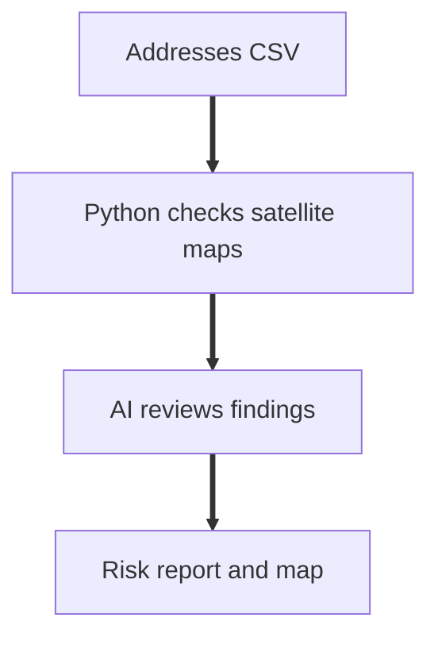
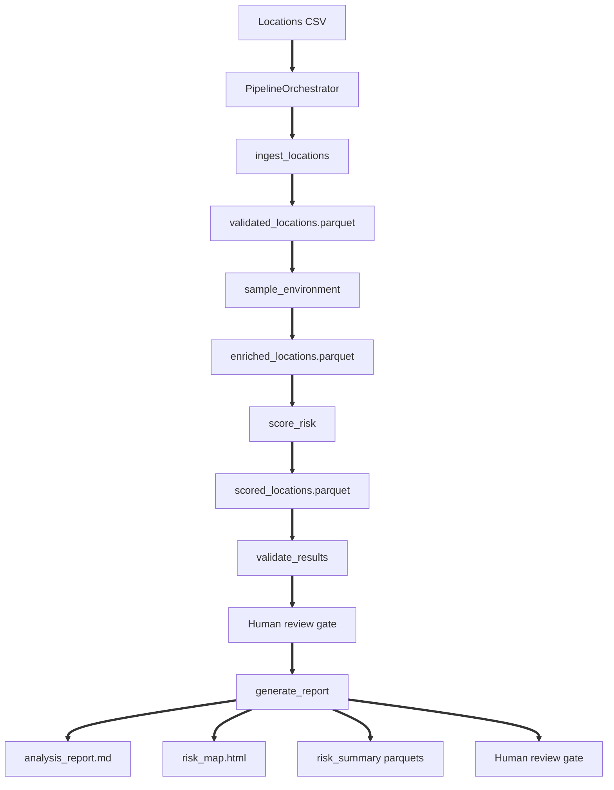

# System Architecture

This document describes the pipeline after the Phase 7 redesign.

## Plain English Overview

1. This system reads a list of addresses committed for satellite broadband service.
2. For each address it checks how much sky is visible using government maps of canopy, terrain, and land cover.
3. A single AI call reviews results at each step and writes a plain English summary flagging likely signal problems.

## Multi agent design

This is a multi agent pipeline with a clear separation between the reasoning layer and the execution layer. The PipelineOrchestrator is the master agent. It uses Claude to reason about pipeline state and decide whether to proceed between steps. Four specialized agents handle execution: IngestionAgent validates and batches the input data, EnvironmentalAgent fetches raster values from local geospatial files, the scoring engine applies the deterministic risk formula, and the output agent generates the report and map. Each agent has a strictly defined scope. IngestionAgent cannot score data. EnvironmentalAgent cannot write outputs. The orchestrator cannot bypass the validation step before generating the report. Claude coordinates these agents by calling them as tools in sequence, reading their output summaries, and deciding whether the pipeline should continue. The Pydantic schemas in src/schemas/location.py enforce the data contract at every handoff between agents. If an agent produces malformed output the next agent fails loudly rather than silently propagating bad data.

## Why Claude is in this pipeline

Claude does not process data in this pipeline. Python processes data. Claude reasons about what the data means and decides whether to keep going. When ingestion finishes Claude reads a small JSON summary showing how many rows were valid, how many were dropped, and what the drop reasons were. It decides if that looks reasonable before proceeding. When enrichment finishes Claude sees the missing data rates and flags anything too high. When scoring is done Claude checks whether the tier distribution makes geographic sense. When validation runs Claude decides whether to generate the report or halt. This is the correct use of a language model in a data pipeline. It sits at the decision layer, not the computation layer. That is why the entire 4.67 million row run cost $0.098. Claude only ever saw summaries, never individual rows.

## Prerequisite Step

The pipeline expects required rasters to exist on disk.
Download the required rasters for North Carolina before running the pipeline.

## Pipeline Flow

This flow shows tools, artifacts, and explicit human review gates.

## What Each Tool Does

Each tool has an input schema and an output schema.
The output schema is documented in `src/agents/orchestrator.py` under `TOOL_OUTPUT_SCHEMAS`.

<table>
  <tr>
    <th>Tool</th>
    <th>Purpose</th>
    <th>Primary artifact</th>
  </tr>
  <tr>
    <td>ingest_locations</td>
    <td>Validates rows, deduplicates, and derives state and county from geoid_cb.</td>
    <td>data/processed/validated_locations.parquet</td>
  </tr>
  <tr>
    <td>sample_environment</td>
    <td>Samples canopy, slope, aspect, and land cover from rasters.</td>
    <td>data/processed/enriched_locations.parquet</td>
  </tr>
  <tr>
    <td>score_risk</td>
    <td>Computes deterministic composite score and tier for each location.</td>
    <td>data/processed/scored_locations.parquet and outputs/scored</td>
  </tr>
  <tr>
    <td>validate_results</td>
    <td>Runs four checks and returns a recommendation.</td>
    <td>Validation report dictionary returned to the orchestrator.</td>
  </tr>
  <tr>
    <td>generate_report</td>
    <td>Writes the report, summary parquets, and interactive map.</td>
    <td>outputs/analysis_report.md and outputs/risk_map.html</td>
  </tr>
</table>

## On demand analysis

In addition to the batch pipeline the system supports on demand queries for individual locations. A field technician can provide a street address or coordinates and get back an immediate risk assessment with a plain English explanation. The agent fetches the three environmental signals for that specific point, scores it, and explains why it received that risk tier. It also returns the top three nearby locations within a configurable distance that have lower risk scores. This directly implements the agentic scenario where a field technician queries a specific address before scheduling an installation visit.

## Failure Modes

<table>
  <tr>
    <th>Failure mode</th>
    <th>What happens</th>
  </tr>
  <tr>
    <td>Tool handler error</td>
    <td>Returns error JSON to the AI orchestration loop instead of raising.</td>
  </tr>
  <tr>
    <td>Geographic sanity violation</td>
    <td>Halts with failed status and halt recommendation.</td>
  </tr>
  <tr>
    <td>Map render failure</td>
    <td>Logs MAP_RENDER_FAILED and continues, keeping report and parquets.</td>
  </tr>
  <tr>
    <td>Interrupt signal</td>
    <td>Logs PIPELINE_INTERRUPTED and exits with code 130.</td>
  </tr>
  <tr>
    <td>Turn limit reached</td>
    <td>Stops if MAX_AGENT_TURNS is reached without end_turn.</td>
  </tr>
</table>
