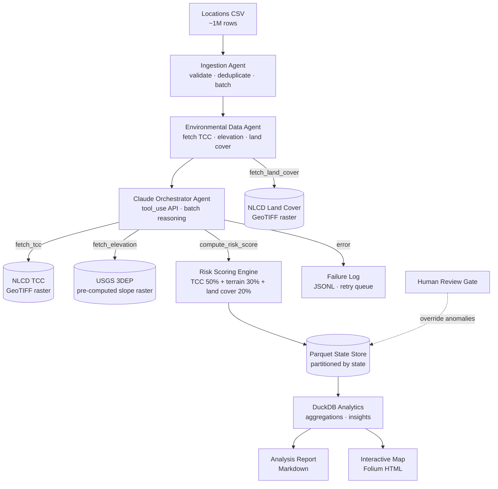
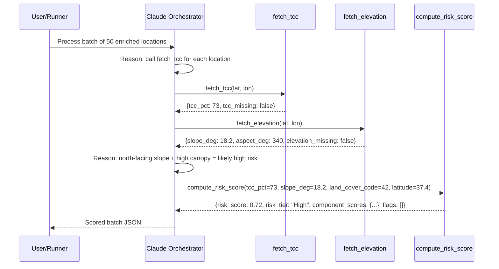

# System Architecture

## Pipeline flow

## Agent sequence

## Why this design

- **Agents have defined contracts.** Every stage boundary is a Pydantic model (`RawLocation` → `ValidatedLocation` → `EnrichedLocation` → `ScoredLocation`). Bad data fails loudly at the boundary instead of silently propagating downstream.
- **Claude orchestrates, it does not score.** Risk scoring is deterministic (see `src/agents/scoring.py`). Claude calls the tools, validates intermediate values, flags anomalies, and writes plain-English explanations. The formula itself is auditable and reproducible.
- **Land cover is not an LLM tool.** `fetch_land_cover` runs deterministically inside the Environmental Data Agent alongside TCC sampling — same NLCD dataset family, same CRS, same resolution. Exposing it to Claude would add cost without adding reasoning value. The land-cover code is passed into `compute_risk_score` as a plain integer input.
- **Slope is pre-computed.** Computing slope per-point via Horn's method at 1M locations = 1M 3x3 windowed rasterio reads. Pre-computing the full slope raster once = 1 GDAL operation + 1M cheap pixel lookups. ~100x speedup. See `src/data/downloader.py:precompute_slope_raster`.
- **Parquet + DuckDB instead of PostgreSQL.** Columnar Parquet partitioned by state is resumable (skip already-scored partitions on restart) and DuckDB queries it directly with SQL — no database server, no Docker, no ETL.
